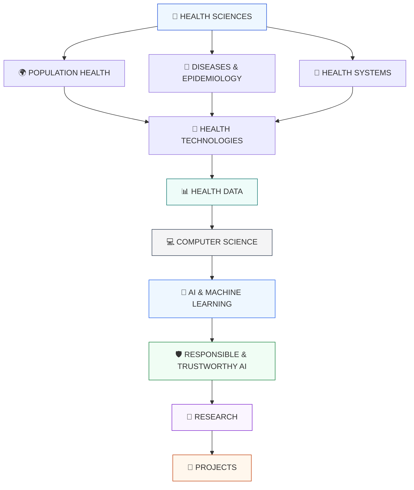

# 🧬 BIOMEDICAL & HEALTH INFORMATICS LAB

### **Health × Data × Computer Science × AI**

> An interdisciplinary research lab exploring the intersection of biomedical and health sciences, population health, health informatics, computational methods, artificial intelligence, and responsible digital health.

---

## 🔬 Research Vision

This laboratory is a structured learning and research space connecting **health sciences** with **computer science, data, artificial intelligence, and responsible technology**.

The goal is to progressively investigate how computational methods can support:

* 🧬 Biomedical and health sciences
* 🌍 Population health and epidemiology
* 🏥 Health systems and digital transformation
* 📊 Health data and statistical analysis
* 💻 Computer science and computational methods
* 🤖 Artificial intelligence and machine learning
* 🛡️ Responsible and trustworthy health AI
* 🔎 Scientific research and reproducibility

---

# 🗺️ RESEARCH MAP



---

# 🧭 RESEARCH DOMAINS

## 01 · 🧬 Health Sciences

Foundational knowledge in:

* Anatomy
* Physiology
* Health promotion
* Disease prevention
* Public health
* Maternal and child health
* Aging and healthy longevity
* Health education
* Population health

[→ Explore Health Sciences](./01-health-sciences/)

---

## 02 · 🌍 Population Health

Understanding health at the population level through:

* Epidemiology
* Disease surveillance
* Prevention
* Health promotion
* Health inequalities
* Population-level data
* Global health
* Public health intelligence

[→ Explore Population Health](./02-population-health/)

---

## 03 · 🦠 Diseases & Epidemiology

A structured knowledge base covering major disease areas:

* Infectious diseases
* Antimicrobial resistance
* Cancer
* Cardiovascular diseases
* Diabetes
* Respiratory diseases
* Neurological diseases
* Mental health
* Chronic diseases

Each topic will progressively connect:

**Biology → Epidemiology → Prevention → Data → Technology → AI → Ethics → Research**

[→ Explore Diseases & Epidemiology](./03-diseases-epidemiology/)

---

## 04 · 🏥 Health Systems

Exploring how health services and information systems operate:

* Primary healthcare
* Hospitals
* Electronic Health Records
* Hospital Information Systems
* Health Information Systems
* Clinical workflows
* Interoperability
* HL7 / FHIR
* Health Information Exchange
* Digital transformation

[→ Explore Health Systems](./04-health-systems/)

---

## 05 · 📱 Digital & Biomedical Technologies

Technology applied to health and biomedical environments:

* Digital health
* Telemedicine
* mHealth
* Wearable technologies
* Remote monitoring
* Medical devices
* Medical imaging
* Biomedical robotics
* Digital therapeutics
* Edge AI
* Digital twins
* Neurotechnology

[→ Explore Health Technologies](./05-health-technologies/)

---

## 06 · 📊 Health Data & Statistics

Building the quantitative foundation required for health informatics:

* Data literacy
* Descriptive statistics
* Probability
* Epidemiological data
* Data cleaning
* Databases
* SQL
* Python
* NumPy
* pandas
* Data visualization
* Synthetic data
* Health data quality

[→ Explore Health Data](./06-health-data/)

---

## 07 · 💻 Computer Science

Developing computational foundations:

* Python programming
* Computational thinking
* Algorithms
* Data structures
* Databases
* Software engineering
* Version control
* Git & GitHub
* Testing
* Problem solving

[→ Explore Computer Science](./07-computer-science/)

---

## 08 · 🤖 AI & Machine Learning

Exploring computational intelligence for health applications:

* Machine learning
* Deep learning
* Natural language processing
* Computer vision
* Time-series analysis
* Model evaluation
* Explainable AI
* AI for healthcare
* Medical imaging AI
* Risk prediction
* Clinical decision support

[→ Explore AI & Machine Learning](./08-ai-machine-learning/)

---

## 09 · 🛡️ Responsible & Trustworthy AI

Studying the conditions required for safe and responsible deployment of AI in high-stakes health environments:

* Privacy
* Security
* Bias
* Fairness
* Transparency
* Explainability
* Human oversight
* Accountability
* AI safety
* AI governance
* Data governance

[→ Explore Responsible AI](./09-responsible-ai/)

---

# 🔎 RESEARCH

The laboratory follows a research-oriented workflow:

```text
Question
   ↓
Literature Review
   ↓
Data & Evidence
   ↓
Methods
   ↓
Computational Analysis
   ↓
Evaluation
   ↓
Interpretation
   ↓
Responsible AI / Ethics
   ↓
Reproducible Research
```

Research activities may include:

* Literature reviews
* Research questions
* Scientific reading
* Data analysis
* Computational experiments
* Research notebooks
* Reproducible workflows
* Scientific writing
* Evidence synthesis

[→ Explore Research](./10-research/)

---

# 🚀 PROJECTS

The laboratory will progressively develop research and technical projects.

### 01 · Public Health Data Intelligence

Exploring how statistical and computational methods can transform population-level health data into interpretable evidence.

**Focus:**
`Public Health × Statistics × Python × Data Visualization`

---

### 02 · Health Machine Learning

Experimental machine-learning workflows using public or synthetic health datasets.

**Focus:**
`Health Data × Machine Learning × Evaluation`

---

### 03 · Synthetic Health Information System

A safe experimental health-information environment based exclusively on synthetic or public data.

**Focus:**
`Health Systems × Databases × Interoperability × Software`

---

### 04 · Responsible Health AI

A research project examining governance, transparency, privacy, accountability, and human oversight in AI-enabled health systems.

**Focus:**
`AI × Health × Ethics × Governance`

[→ Explore Projects](./11-projects/)

---

# 📚 EVIDENCE & LEARNING

This section documents the development of knowledge and technical capabilities.

### Academic Foundations

* Health Sciences
* Population Health
* Computer Science
* Statistics
* Health Informatics

### Technical Development

* Python
* Data Analysis
* SQL
* Git & GitHub
* Machine Learning
* AI

### Research Development

* Scientific literature
* Research methodology
* Evidence synthesis
* Reproducibility
* Scientific communication

### Learning Status

| Area               | Status         |
| ------------------ | -------------- |
| Health Sciences    | ✅ Foundation   |
| Population Health  | 🔄 Developing  |
| Computer Science   | 🔄 In Progress |
| Python             | 🔄 In Progress |
| Statistics         | 🔄 Developing  |
| Health Informatics | 🔄 Developing  |
| SQL                | 📌 Planned     |
| Machine Learning   | 📌 Planned     |
| AI for Health      | 📌 Planned     |
| Responsible AI     | 🔄 Developing  |
| Research Methods   | 🔄 Developing  |

> **Principle:** This laboratory distinguishes clearly between established knowledge, active learning, planned work, and completed research.

[→ Explore Evidence & Learning](./12-evidence-learning/)

---

# 🌐 INTERDISCIPLINARY FRAMEWORK

```text
                 🧬 HEALTH
                    │
        ┌───────────┼───────────┐
        ↓           ↓           ↓
   🌍 Population  🦠 Diseases  🏥 Systems
        │           │           │
        └───────────┼───────────┘
                    ↓
             📱 TECHNOLOGY
                    ↓
               📊 DATA
                    ↓
             💻 COMPUTER SCIENCE
                    ↓
              🤖 ARTIFICIAL
              INTELLIGENCE
                    ↓
            🛡️ RESPONSIBLE AI
                    ↓
                 🔎 RESEARCH
                    ↓
                🚀 IMPACT
```

---

# 🎯 LONG-TERM RESEARCH DIRECTIONS

The laboratory may progressively explore:

* AI for public health
* Health data intelligence
* Biomedical AI
* Digital health systems
* Health information interoperability
* AI-assisted epidemiology
* Medical imaging
* Population-level prediction
* Synthetic health data
* Responsible health AI
* AI governance in high-stakes institutions
* Global and digital health
* One Health and computational approaches

---

## 📌 Research Principles

**Evidence first.**
Use scientific literature, public datasets, and reproducible methods.

**No unsupported expertise claims.**
Learning status is documented honestly.

**Privacy by design.**
No confidential institutional or personal health data is published.

**Responsible AI.**
Health AI must be examined together with safety, fairness, privacy, transparency, and human oversight.

**Reproducibility.**
Methods, assumptions, datasets, and computational workflows should be documented whenever possible.

---

# 🧬 HEALTH × DATA × COMPUTATION × AI

### Building an interdisciplinary foundation for the future of digital and biomedical health research.

---

**Status:** Active Learning & Research Laboratory
**Focus:** Biomedical & Health Informatics
**Approach:** Evidence → Data → Computation → AI → Responsible Innovation
